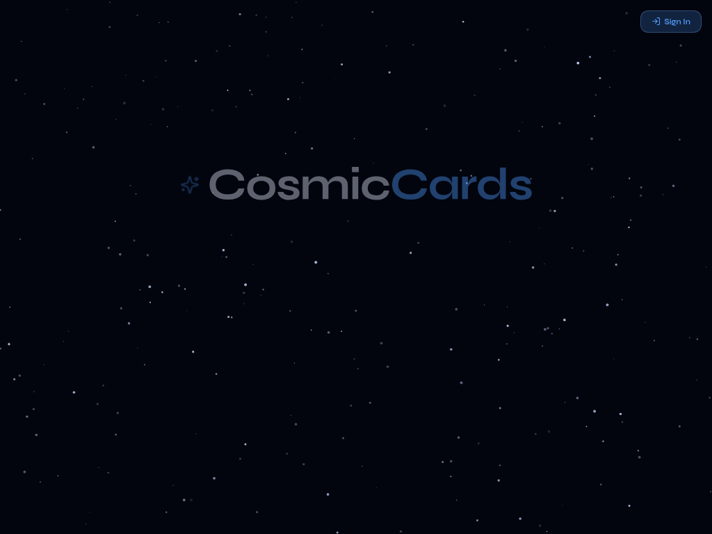
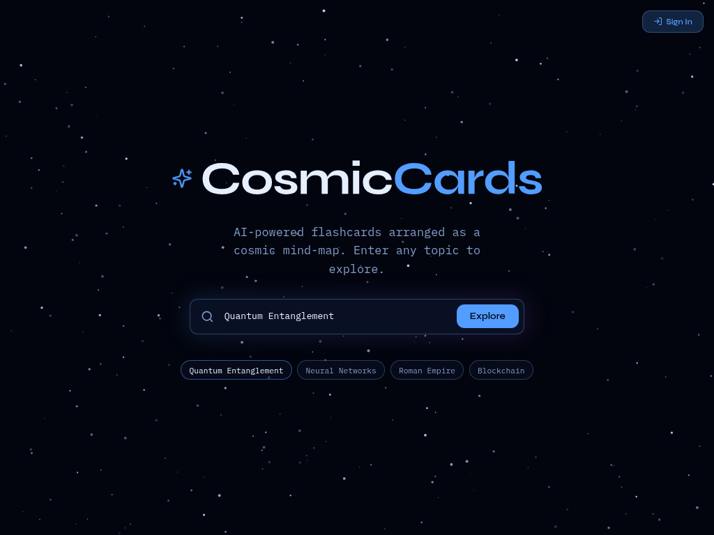

# CosmicCards

> AI-powered flashcards arranged as an infinite cosmic mind-map. Turn any topic into a visual constellation of knowledge.

<p align="center">
  
</p>

---

## What is CosmicCards?

CosmicCards is an interactive learning tool that transforms any topic into a beautiful, explorable mind-map of AI-generated flashcards. Instead of static lists, your cards float in a cosmic canvas — organized by subtopics in a radial layout against a dark starfield backdrop.

**Key idea:** Type any subject you want to learn, and CosmicCards generates 60–80 high-quality flashcards grouped into subtopics, then lays them out as an infinite pan-and-zoom canvas you can explore like a map of knowledge.

---

## Features

### AI Flashcard Generation
- Enter any topic — from "Quantum Entanglement" to "Roman Empire" — and get a rich set of flashcards in seconds.
- Cards are intelligently grouped into **subtopics** (branches) for organized learning.
- Each card includes a **question** and a detailed **answer** (2–4 sentences with concrete examples).
- Coverage spans fundamentals, intermediate concepts, advanced topics, real-world applications, history, edge cases, and common misconceptions.

### Infinite Cosmic Canvas
- Cards are arranged in a **radial mind-map layout** — the main topic at the center, subtopics branching outward.
- **Pan and zoom** freely across the canvas to explore different areas.
- Dark cosmic aesthetic with an animated **starfield background**.
- Smooth animations and transitions powered by Framer Motion.

### Interactive Study Mode
- Click any card to open a **full-screen study modal** with the question and answer.
- Use keyboard navigation to flip through cards sequentially.
- Cards are color-coded by subtopic for visual organization.

### Spaced Repetition (SM-2)
- Each card tracks a **due date** based on the SM-2 algorithm.
- Cards show a **DUE** badge when they're ready for review.
- Reinforce long-term retention as you revisit cards at optimal intervals.

### Topic History & Persistence
- Recently explored topics are saved in your **history** — one click to reopen.
- **User authentication** syncs your topic history across devices.
- Sign up with email/password or use the demo mode with local storage.

### AI Chat Assistant
- An integrated **chat panel** lets you ask follow-up questions about any topic.
- Get explanations, clarifications, or dive deeper into concepts without leaving the canvas.

---

## Tech Stack

| Layer | Technology |
|-------|------------|
| **Frontend** | React 18, TypeScript, Vite |
| **Styling** | Tailwind CSS, shadcn/ui |
| **Animations** | Framer Motion |
| **State** | Zustand |
| **Backend** | Lovable Cloud (Supabase) — Auth, Database, Edge Functions |
| **AI** | Lovable AI Gateway (Gemini models) |

---

## Screenshots

### Landing Page
A minimal, cosmic-themed entry point. Type a topic and hit **Explore**.

<p align="center">
  
</p>

### Cosmic Mind-Map Canvas
Your generated flashcards arranged as an infinite, pan-able constellation.

<p align="center">
  
</p>

---

## How to Use

1. **Enter a topic** on the landing page (e.g., "Neural Networks", "Blockchain", "Ancient Greece").
2. **Wait a moment** while the AI generates 60–80 flashcards across multiple subtopics.
3. **Explore the canvas** — pan and zoom to navigate the mind-map.
4. **Click any card** to study it. Flip through cards with arrow keys.
5. **Use the chat button** to ask the AI follow-up questions.
6. **Sign in** to sync your topic history across devices.

---

## Development

```bash
# Install dependencies
bun install

# Start the dev server
bun run dev

# Run tests
bun test
```

---

## Project Info

- **Built with:** [Lovable](https://lovable.dev)
- **Live Preview:** [Open App](https://cosmic-cards-v3.lovable.app)

---

<p align="center">
  Made with ✨ and curiosity.
</p>
